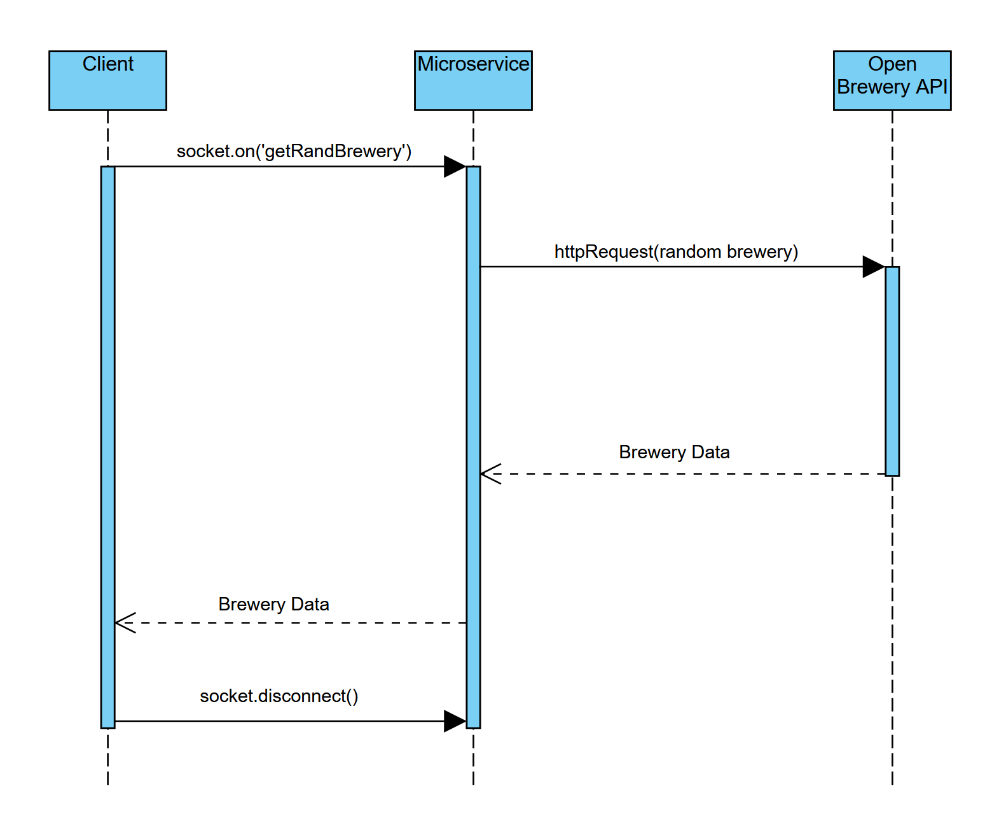

# CS361 Microservice
Author: James Cole
Date: 02/08/13
Class: CS361 Winter

## REQUEST - How to
1. As per the documentation on the [socket.io](https://socket.io/docs/v4/client-initialization/) website, import the socket.io module. It is recommended to use the ESM import option: `import { io } from "https://cdn.socket.io/4.3.2/socket.io.esm.min.js";`
2. Set the socket host address to jcole.net and use port 44441: `const socket = io('ws://jcole.net:44441');`
3. Request the data from the server by connecting to the socket using the 'getRandBrewery' event: `socket.on('getRandBrewery', <Your callback function here> );`

## RECEIVE - How to
1. Once the `socket.on()` method is called, the microservice will respond with JSON data. The receiving data will be an array that contains a single object - the data of the random brewery requested.
2. The data will be saved to the parameter included in the callback function for the `socket.on()` method. For example, to request and print the random brewery to the browser's console: `socket.on('getRandBrewery', (brewData) => { console.log(brewData[0]) });`

## UML diagram
